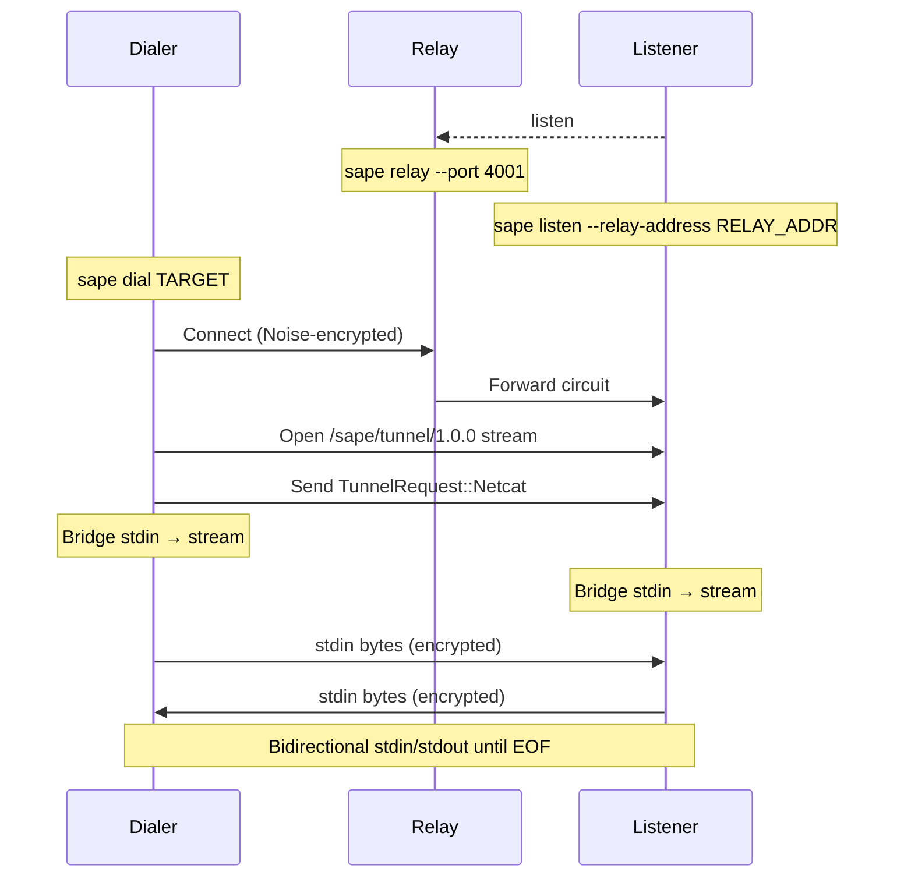
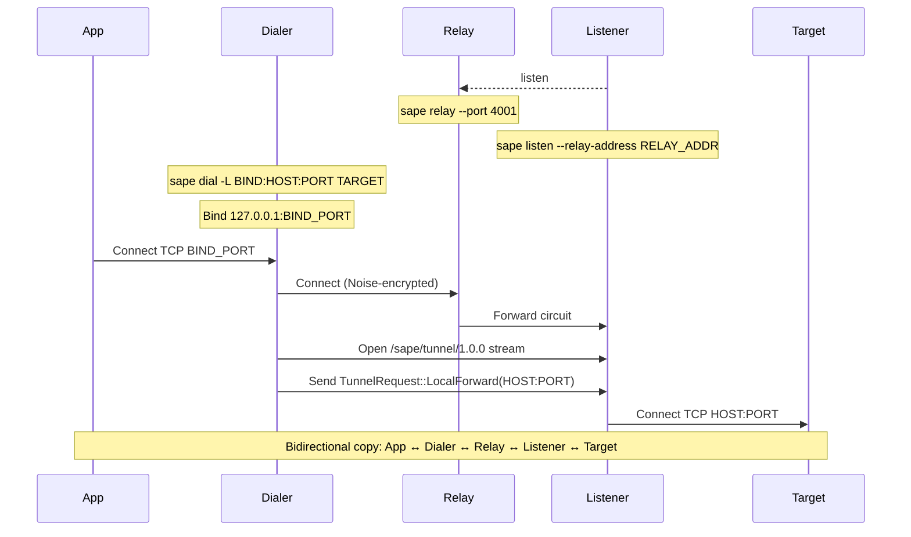
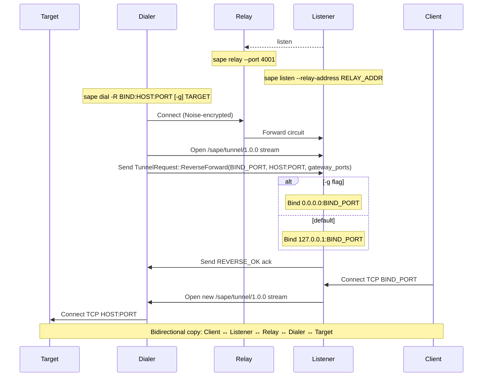
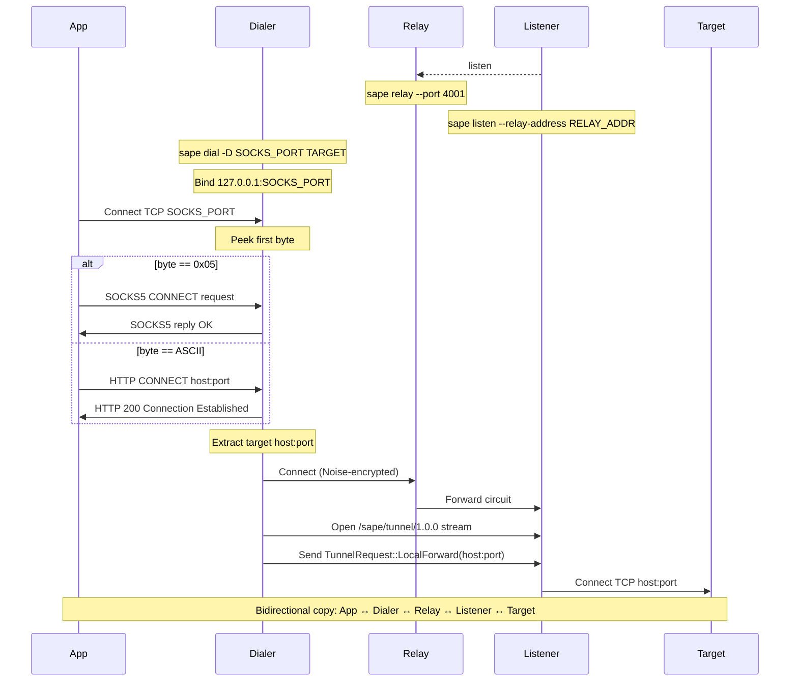
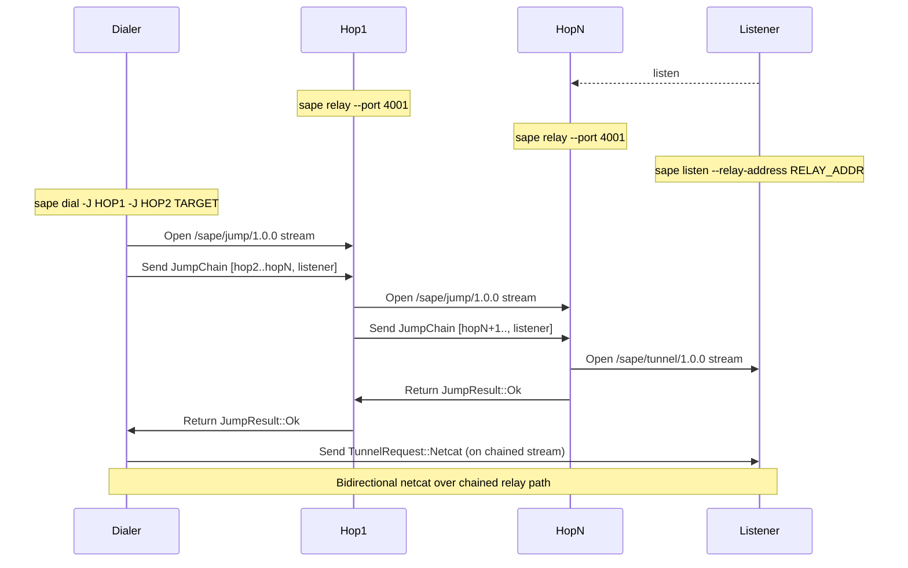
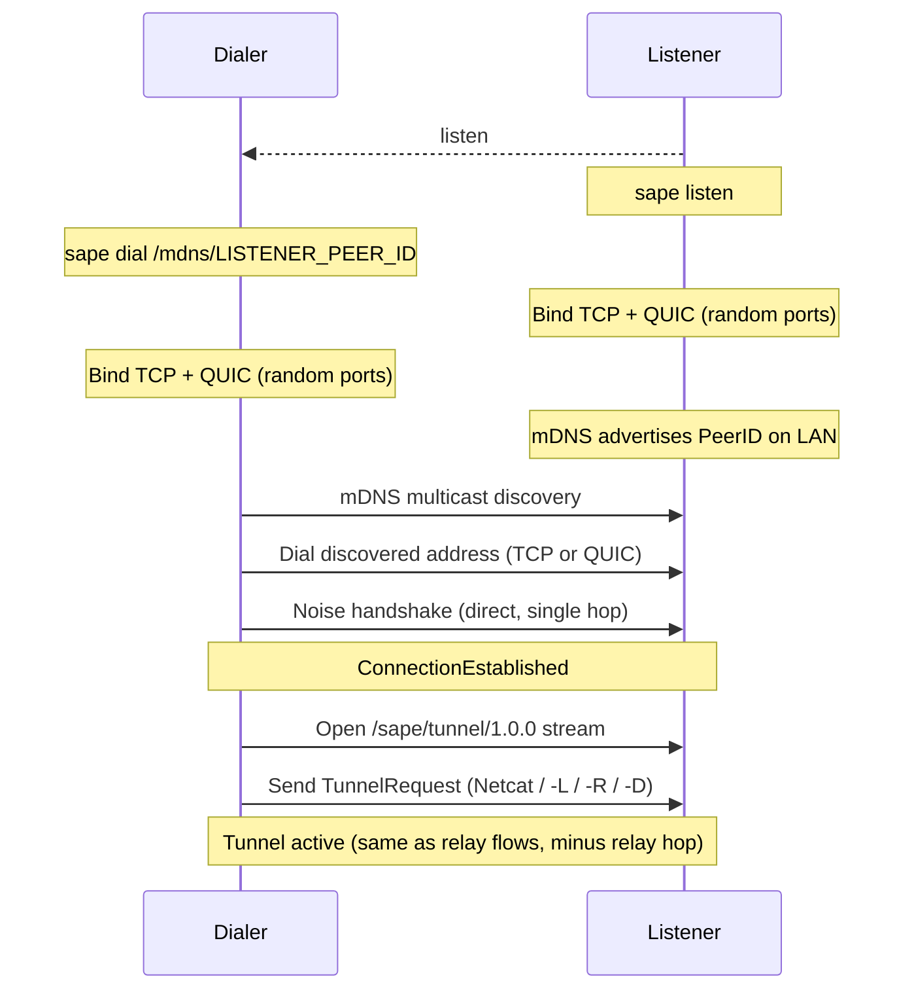

# `sape` Tunnel Architecture (`netcat`, `-L`, `-R`, `-D`, mDNS)

This document explains the CLI-first tunnel architecture for:

- default netcat mode (`sape dial <TARGET>`)
- local forward (`-L`)
- reverse forward (`-R`, `-g/--gateway-ports`)
- proxy mode (`-D`, SOCKS5 + HTTP CONNECT)
- mDNS LAN discovery (direct P2P, no relay)

All inter-peer traffic is encrypted by libp2p Noise. The transport stack is
configured in `sape/src/client/builder.rs` using:

- TCP + Noise + Yamux
- QUIC
- WebSocket + Noise + Yamux
- Relay client (for circuit relay paths)

## Shared Control Plane

All tunnel modes use the same application protocol:

- protocol id: `/sape/tunnel/1.0.0`
- frame format: 4-byte length prefix + postcard payload
- request enum: `TunnelRequest::{Netcat, LocalForward, ReverseForward}`
- max request size: 64 KiB

Defined in `sape/src/tunnel.rs`.

## 1) Default Netcat Flow



Notes:

- This is raw interactive stream bridging (stdin/stdout).
- Relay can forward packets, but cannot decrypt end-to-end payload.

## 2) Local Forward (`-L`) Flow



Notes:

- Local bind is on the dialer side.
- Forward target is reached from the listener side.

## 3) Reverse Forward (`-R`) Flow



Notes:

- Without `-g`, listener-side bind uses `127.0.0.1`.
- With `-g`, listener-side bind uses `0.0.0.0` (SSH `GatewayPorts` behavior).

## 4) Proxy Mode (`-D`) Flow



Notes:

- One local port serves both SOCKS5 and HTTP CONNECT.
- Protocol selection is automatic from the first byte.
- `socks5h`/`--socks5-hostname` keeps DNS resolution remote through tunnel.

## 5) Jump Chain (`-J`) Flow (netcat mode)



Notes:

- Jump control protocol id is `/sape/jump/1.0.0`.
- Jump tunnel data still uses `/sape/tunnel/1.0.0` after chain setup.
- Current implementation supports jump chaining for netcat mode only.

## 6) mDNS LAN Discovery Flow

When both peers are on the same LAN, mDNS enables direct peer discovery without
a relay server. The listener advertises its PeerID via multicast DNS, and the
dialer discovers it automatically. All tunnel modes (`netcat`, `-L`, `-R`, `-D`)
work identically after the direct connection is established.



Notes:

- No relay server is needed. Connection is direct TCP or QUIC on the LAN.
- Only a single Noise handshake occurs (vs 3 for relayed connections).
- mDNS is always enabled in the client swarm (`sape/src/client/builder.rs`).
- Listener CLI: `sape listen` (no `--relay-address`).
- Dialer CLI: `sape dial /mdns/<PEER_ID>`.

## Encryption Guarantees

- Inter-peer traffic for all six flows runs through libp2p encrypted channels.
- Relay nodes forward encrypted frames and do not terminate end-to-end
  application streams.
- Local loopback segments (app -> `127.0.0.1:...` proxy/forward bind) are local
  host traffic, not network-exposed encryption boundaries.

## Diagram Sources

Mermaid sources used for rendering are in:

- `docs/diagrams/netcat_flow.mmd`
- `docs/diagrams/local_forward_flow.mmd`
- `docs/diagrams/reverse_forward_flow.mmd`
- `docs/diagrams/socks_proxy_flow.mmd`
- `docs/diagrams/jump_flow.mmd`
- `docs/diagrams/mdns_flow.mmd`

ASCII renders (generated with
[`beautiful-mermaid`](https://www.npmjs.com/package/beautiful-mermaid) via Deno)
are in:

- `docs/diagrams/netcat_flow.txt`
- `docs/diagrams/local_forward_flow.txt`
- `docs/diagrams/reverse_forward_flow.txt`
- `docs/diagrams/socks_proxy_flow.txt`
- `docs/diagrams/jump_flow.txt`
- `docs/diagrams/mdns_flow.txt`

Regenerate all diagrams:

```bash
deno task docs:diagrams
```

All Mermaid sequence diagrams use top-to-bottom participant columns for
process-oriented visualization on GitHub.
